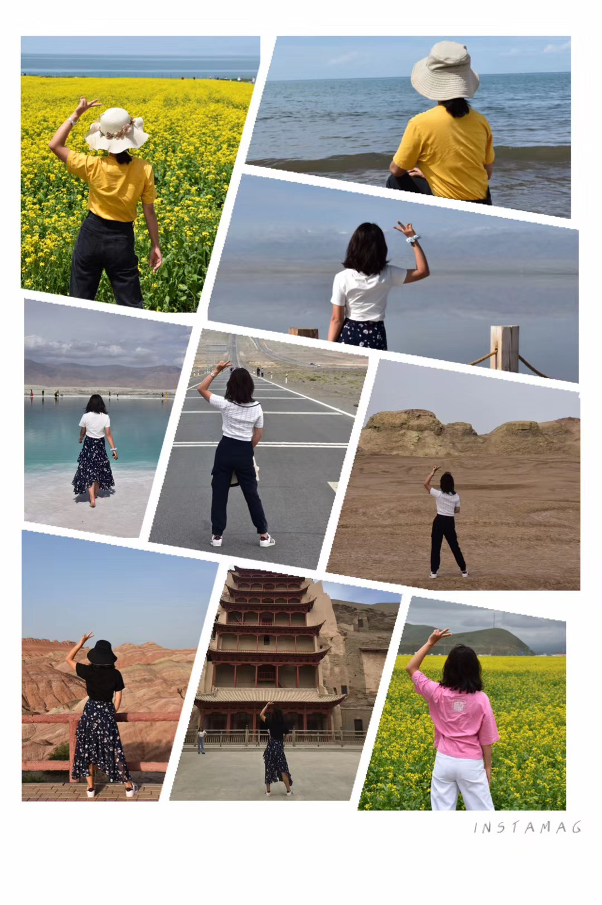

## Bio 📔

I am a new student in the Bloomberg School of Public Health in the Johns Hopkins University. I major in epidemiology, especially in the track of clinical trials and evidence synthesis. 

Actually, I have 8-year experience in clinical medicine, and have finished 3-year residency training in a tertiary hospital in Beijing, China. I have acquired the doctor's license in China. 

Because of the COVID-19 pandemic and the experience of clinical training, I increasingly realized the significance of public health, which focuses on the entire population, rather than individuals. The progress and development in public health are really important and meaningful to the whole society and humanbeings. As a result, I transfer my interest from clinical medicine to epidemiology, with the expectation to improve the health of not only individuals, but also the population.

## Education 🎓

**Capital Medical School** \| Beijing, China

M.D. in Neurology \| Beijing Tiantan Hospital

**The Central South University** \| Changsha, China

B.S. in Clinical Medicine \| Xiangya School of Medicine

## Research Interests ❤️

Neurological diseases, such as stroke, Alzheimer's disease, Amyotrophic Lateral Disease, etc.

Cancer, especially cancer-related genetics

## Experience about data analysis 💔

I once worked with SPSS. I'm sorry for the near-to-null experience in programming, no matter with R or Phython.

## My expectation in this class 🎈

I hope to be familiar with R and know how to utilize R to analyze and visualize biomedical data.

## Hobbies: Cooking and Traveling

{width="45%"} {width="45%"}
